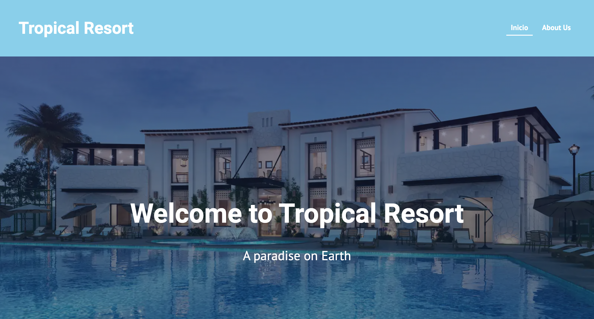

# Tropical Resort

### Deploy link: [tropical-resort]()


## Introduction

Tropical Resort is an easy website, with server-side rendering, developed with Gatsby. The aim of that project was understand how to use Gatsby and improve the SEO positioning of a website.

## Functional Description

User can see a main page and the detail of the previewed rooms showed, also an about us page.

## Technical Description

Developed with: CSS + styled components, Gatsby, GraphQL and DatoCMS.

## Follow the next steps

Have installed node (+npm)

Start the gatsby site by using the following command:
```
npm run start 
```

_NOTE > You can also use:_
```
gatsby develop
```

_NOTE: You'll also see a second link: _`http://localhost:8000/___graphql`_. This is a tool you can use to experiment with querying your data. Learn more about using this tool in the [Gatsby tutorial](https://www.gatsbyjs.org/tutorial/part-five/#introducing-graphiql).